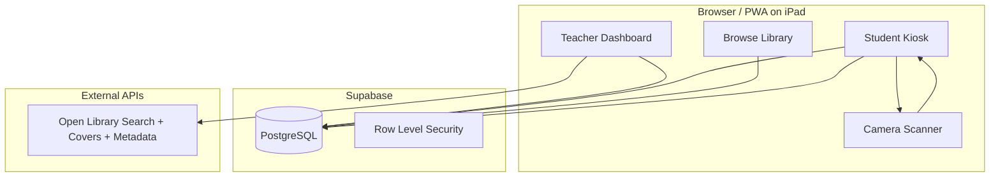
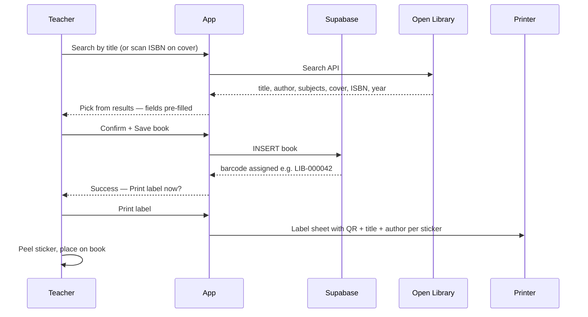
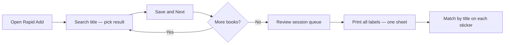
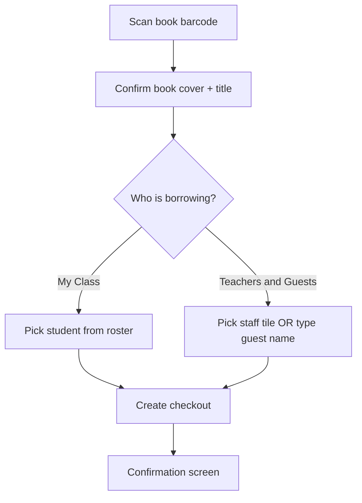

# Class Library — Project Plan

_Planning document — final version before implementation (May 2026)._


## Your choices (locked in)


| Decision         | Choice                                                             |
| ---------------- | ------------------------------------------------------------------ |
| Hosting          | Cloud-hosted, tablet-optimized (PWA installable on iPads)          |
| Student checkout | Tap/type name — no login (students + staff + guests)               |
| Barcodes         | Custom library IDs (works for every book, including hand-me-downs) |


## Recommended stack

Match patterns from your existing `[Projects/disc-check](Projects/disc-check)` project:

- **Frontend:** React 19 + Vite + React Router + PWA (`vite-plugin-pwa`)
- **Backend/data:** Supabase (PostgreSQL, REST API, optional real-time for live “who has what” board)
- **Deploy:** Vercel (frontend) + Supabase cloud (database)
- **New project path:** `~/Projects/class-library`

Why this stack: you already use it, it supports cloud + classroom tablets via PWA, camera barcode scanning works in mobile Safari/Chrome, and Supabase avoids running your own server.

## Architecture




## Data model

```sql
-- books
id              uuid PK
barcode         text UNIQUE NOT NULL   -- e.g. "LIB-000042"
title           text NOT NULL
author          text
genre           text                    -- mapped from Open Library subjects
cover_url       text                    -- cached from Open Library
isbn            text NULL               -- from Open Library when available
publish_year    int NULL                -- first_publish_year from Open Library
open_library_key text NULL              -- e.g. /works/OL123W — for re-fetch / dedup
reading_level   text NULL               -- optional manual override
status          text                    -- 'available' | 'checked_out'
label_printed_at timestamptz NULL       -- set when sticker scan-confirmed; powers "Needs label" filter
created_at      timestamptz

-- borrowers (class roster + staff/friends — powers kiosk name picker)
id              uuid PK
display_name    text NOT NULL
borrower_type   text NOT NULL           -- 'student' | 'staff' | 'guest'
active          boolean DEFAULT true
created_at      timestamptz

-- checkouts
id              uuid PK
book_id         uuid FK -> books
borrower_name   text NOT NULL           -- denormalized display name at checkout time
borrower_type   text NOT NULL           -- 'student' | 'staff' | 'guest'
checked_out_at  timestamptz NOT NULL
returned_at     timestamptz NULL
```

**Borrower types:**

- `student` — child in the class roster
- `staff` — teachers, aides, co-teachers, regular volunteers (pre-loaded by teacher)
- `guest` — one-off borrowers (family friend, visitor); name typed at kiosk; not saved to roster unless teacher promotes them to staff

**Checkout duration:** computed as `now() - checked_out_at` for active loans; stored `returned_at` for history. Overdue = active checkout older than configurable threshold (default **14 days**, teacher-editable in settings). Teacher overdue view can filter by borrower type (students vs staff/guests).

## Barcode system

- **Format:** `LIB-` + zero-padded 6-digit ID (e.g. `LIB-000001`) encoded as **QR code** on printed labels (most reliable on tablet cameras).
- **Generation:** server-side sequence in Supabase when a book is created.
- **Print flow:** `/labels/print?ids=...` renders a print-friendly sheet (Avery 5160–style or simple grid). Uses browser print dialog.
- **Scan flow:** `[html5-qrcode](https://github.com/mebjas/html5-qrcode)` in Student Kiosk and teacher scan flows. Requires HTTPS (Vercel provides this).

### Label layout (each sticker)

Every label includes human-readable text so teachers **never need to match by stack order** — find the book by title on the sheet:

```
┌─────────────────────────┐
│  [QR code]              │
│                         │
│  The Very Hungry        │  ← title (truncate at 2 lines)
│  Caterpillar            │
│  Eric Carle             │  ← author (1 line, smaller)
│  LIB-000042             │  ← barcode text under QR
└─────────────────────────┘
```

- Title: primary text, max ~28 chars/line, 2-line clamp with ellipsis
- Author: secondary/muted text, 1 line
- Barcode ID: monospace below QR for manual lookup fallback
- Avery 5160: 30 labels/sheet (1" × 2⅝"); layout uses `@media print` CSS grid aligned to label dimensions
- Batch print: labels appear in selectable sort order (default: title A–Z) — **order no longer matters** because each sticker is self-identifying

## Add book → print label workflow (detailed)

### Which happens first?

**Add the book first, then print the label.** Always.

The barcode is not pre-generated — it is assigned the moment the book record is saved to the database. The printed sticker is just a physical copy of that ID so the iPad scanner can look the book up later. Without a saved book record, a label would point to nothing.




### Single-book flow (step by step)

1. **Teacher opens** `/teacher/add`.
2. **Search-first entry:** type a few words of the title (or author) → Open Library returns matching editions.
3. **Pick the correct result** from a list showing cover thumbnail + title + author + year. All metadata fields auto-fill:
  - title, author, cover URL, ISBN, publish year, genre (derived from subjects)
4. **Review / tweak** any field if the match is slightly wrong; override genre or cover if needed.
5. **Tap Save.** DB row created, barcode assigned (e.g. `LIB-000042`).
6. **Post-save prompt:** “Print label now?” or “Print later” (book gets “Needs label” badge).
7. **Physical step:** find the book’s title on the printed sheet, peel that sticker, apply to book.
8. **Optional verify:** scan sticker from book detail page.

**Fallback:** if Open Library has no match, teacher enters title/author manually and saves with a placeholder cover.

**Re-printing:** If a label is lost or damaged, go to the book detail page or `/teacher/labels`, select that book, and print again — same barcode, no new record needed.

### What “scan to add” means (not print-first)

Scanning during **add** is only for **editing an existing book** (e.g. you already printed a label and want to pull up that record). It is not a way to create a book before saving — the barcode must already exist in the system.

---

## Bulk adding many books (most efficient workflows)

For a classroom library of 50–300 books, the goal is: **minimize clicks per book, batch the printing, avoid doing print-one-save-one-repeat.**

### Recommended: Rapid Add Mode + batch print at end

This is the primary v1 bulk workflow — no CSV required.




**Session flow:**

1. Teacher opens **Rapid Add** (`/teacher/add?mode=rapid`).
2. After each **Save & Next:**
  - Search → pick Open Library result (metadata auto-fills) → save
  - Form clears; focus returns to search field
  - Book added to session queue
3. When done, tap **Review queue** — N books with thumbnails.
4. Tap **Print all labels** — one print job; each label shows QR + **title + author** so order doesn’t matter.
5. **Physical matching:** scan the printed sheet for each book’s title (or sort sheet A–Z and pull books from shelf in same order — optional, not required).

### Secondary: multi-select print from catalog

For books added over several days without labels:

1. Go to `/teacher/labels`
2. Filter: **“Needs label”** (books where `label_printed_at IS NULL`)
3. Select all (or shift-select a range)
4. Print one combined sheet, apply stickers using the on-screen match list.
5. **Confirm each sticker:** scan the LIB- QR after applying — clears the "Needs label" badge for that copy only.

`label_printed_at` is set when a sticker is **scan-confirmed** (not when the print dialog opens). Teachers can **Mark as needs label** on a book detail page if a sticker was lost or misapplied.

Add optional DB field: `label_printed_at timestamptz NULL` — tracking only; does not affect barcode.

### Tertiary: CSV import (best if you already have a spreadsheet)

If the teacher already has a list in Google Sheets / Excel:

1. Columns: `title`, `author`, `genre` (optional)
2. Upload at `/teacher/import`
3. Preview table → confirm → bulk INSERT (barcodes assigned in one transaction)
4. Redirect to **Print labels for imported books**

Good for 100+ books when data already exists. Included in v1 as a stretch goal after Rapid Add.

### What to avoid


| Approach                                   | Problem                                                                                                                 |
| ------------------------------------------ | ----------------------------------------------------------------------------------------------------------------------- |
| Print blank/pre-numbered labels first      | Barcodes wouldn’t match DB records unless you pre-seed empty rows — extra complexity, easy to mismatch sticker and book |
| Add book without printing, no tracking     | Books in catalog but no sticker → students can’t scan them at kiosk                                                     |
| Print one label per save with print dialog | Works but very slow for 100+ books                                                                                      |


### Suggested physical setup for a bulk session

1. **Stack of books** on desk
2. **Laptop or iPad** with Rapid Add open
3. For each book: search title → pick result → Save & Next (~5–10 sec/book once familiar)
4. **One print job** at end
5. Walk the sheet: read title on each sticker, find that book, apply — no stack-order memory needed
6. Spot-check: scan 2–3 random books in kiosk

**Time estimate:** ~100 books ≈ 15–25 min with search-and-pick (vs 30–45 min manual entry) + 10 min printing/sticking.

---

## Open Library metadata (full auto-fill)

Use **Open Library** (free, no API key) for search + metadata, not just covers.

### Search API + autosuggest (yes — safe with guardrails)

**Autosuggest is the planned add-book UX** and is **not too many API requests** for a single teacher cataloging books. Open Library’s search endpoint is free, requires no API key, and a classroom cataloging session is well within reasonable use.

`GET https://openlibrary.org/search.json?q={query}&limit=8&fields=key,title,author_name,cover_i,first_publish_year,isbn,subject`

#### UX behavior

- Single search field at top of Add Book / Rapid Add
- As teacher types, a **dropdown autosuggest list** appears below (cover thumbnail + title + author + year per row)
- Arrow keys / tap to select; Enter or tap confirms and auto-fills all metadata fields
- Keyboard-first in Rapid Add: type → ↓ pick → Enter to save → field clears for next book

#### Request budget (why this is fine)

Typical typing pattern for one book title (~20 characters):


| Without guardrails               | With guardrails (planned) |
| -------------------------------- | ------------------------- |
| ~20 requests (one per keystroke) | **2–4 requests** per book |


**Guardrails:**

1. **Debounce 350ms** — only fire after teacher pauses typing
2. **Minimum 3 characters** — no request for `"th"` or `"the"`
3. **Abort in-flight requests** — `AbortController` cancels stale queries when the next debounced search fires
4. **Session cache** — in-memory `Map<query, results>`; repeated or backspaced queries hit cache, zero API call
5. **Limit 8 results** — small payload, fast response
6. **No background polling** — requests only while Add Book screen is open and field is focused

**Bulk session estimate (100 books):**

- ~250–400 API calls over 20–30 minutes
- Open Library handles this comfortably for personal/educational use
- If a rate-limit response ever occurs (rare): show “Search paused — try again in a moment” and fall back to manual entry; retry with exponential backoff

#### What we avoid

- Searching on every keystroke with no debounce
- Fetching full work/edition details on every suggest row (search result has enough for add-book)
- Re-querying Open Library on browse/catalog pages (metadata stored in Supabase after save)

### Fields mapped from API → book record


| Open Library field                  | Book field         | Notes                                                          |
| ----------------------------------- | ------------------ | -------------------------------------------------------------- |
| `title`                             | `title`            | Required                                                       |
| `author_name[0]` (join if multiple) | `author`           | Primary author; show all in UI                                 |
| `cover_i`                           | `cover_url`        | `https://covers.openlibrary.org/b/id/{cover_i}-L.jpg`          |
| `subject[]`                         | `genre`            | Map first matching subject to classroom genre enum (see below) |
| `first_publish_year`                | `publish_year`     | Optional display/filter                                        |
| `isbn[0]`                           | `isbn`             | Useful for dedup (“this ISBN already in library”)              |
| `key`                               | `open_library_key` | Store for future re-sync                                       |


### Genre mapping from subjects

Open Library subjects are granular (“Juvenile Fiction”, “Picture books”, “Animals”). Map to a fixed classroom-friendly enum:

- Picture Book, Fiction, Non-Fiction, Biography, Poetry, Graphic Novel, Reference, Other

Mapping rule: check subjects against keyword list (e.g. “picture book” → Picture Book, “biography” → Biography); default to Fiction or Other.

### Dedup guard

Before save, if `isbn` or `open_library_key` already exists in DB, warn: “This book may already be in your library” with link to existing record.

### Manual override

All auto-filled fields remain editable. Teacher can search again to swap edition/cover.

## App routes and screens


| Route              | Audience | Purpose                                                            |
| ------------------ | -------- | ------------------------------------------------------------------ |
| `/`                | All      | Landing: “Browse Library” + “Check Out / Return” + “Teacher Login” |
| `/browse`          | All      | Grid/list of books; filters: genre, author, availability, search   |
| `/books/:id`       | All      | Book detail, cover, checkout status, current borrower, days out    |
| `/kiosk`           | All      | Checkout kiosk: scan → pick borrower (student / staff / guest)     |
| `/teacher`         | Teacher  | Password-protected dashboard                                       |
| `/teacher/add`     | Teacher  | Add book; optional `?mode=rapid` for Save & Next bulk entry        |
| `/teacher/labels`  | Teacher  | Filter “Needs label”, multi-select → print barcode sheet           |
| `/teacher/import`  | Teacher  | CSV upload for bulk create (stretch after Rapid Add)               |
| `/teacher/people`  | Teacher  | Manage borrowers: class roster + staff & friends lists             |
| `/teacher/overdue` | Teacher  | Books out > N days; filter by borrower type                        |

## Figma wireframes (UX reference)

Design file: **[Class Library Catalog](https://www.figma.com/design/7V0T5ZoEisIp5IaNJ08CfA)** — **Wireframes** page  
FigJam flows: **[Class Library - User Flows](https://www.figma.com/board/iElkPd6bQdBffYM3vVgL8r)**

Wireframes are organized in rows by audience. Each frame is labeled with its route path above the screen.

### Row 1 — Public routes (y = 0)

| Route | Frame | Status |
| ----- | ----- | ------ |
| `/` | 01 - Landing | Done |
| `/teacher/add` | 02 - Add Book (autosuggest + preview) | Done |
| `/kiosk` (checkout) | 03 - Kiosk Checkout (My Class tab) | Done |
| `/browse` | 04 - Browse Library | Done |
| *(print preview)* | 05 - Print Labels Sheet | Done — output of `/teacher/labels` |

### Row 2 — Detail + kiosk states + teacher entry (y = 920)

| Route | Frame | Status |
| ----- | ----- | ------ |
| `/books/:id` | /books/:id — Book Detail | Done |
| `/kiosk` (return) | /kiosk — Return a Book | Done |
| `/kiosk` (done) | /kiosk — Checkout Done | Done |
| `/kiosk` (guests tab) | /kiosk — Teachers and Guests tab | Pending |
| `/teacher` (login) | /teacher — Login | Pending |
| `/teacher` (dashboard) | /teacher — Dashboard | Pending |

### Row 3 — Teacher routes (y = 1840)

| Route | Frame | Status |
| ----- | ----- | ------ |
| `/teacher/labels` | /teacher/labels — Select to Print | Pending |
| `/teacher/people` | /teacher/people — Borrowers | Pending |
| `/teacher/overdue` | /teacher/overdue | Pending |
| `/teacher/import` | /teacher/import — CSV | Pending |

### Kiosk note

`/kiosk` is one route with multiple steps shown as separate frames: home → scan → confirm book → pick borrower (My Class **or** Teachers & Guests) → checkout done **or** return success.

### Rapid Add variant

`/teacher/add?mode=rapid` reuses the Add Book frame with **Save & Next** and a session queue; batch print follows queue review (see FigJam sequence diagram).

---

## Checkout kiosk UX (students + non-students)

Designed for supervised classroom use on a shared iPad. Same flow for everyone — only the “who is borrowing?” step changes by borrower type.

### Flow

1. **Home:** two big buttons — “Check Out a Book” / “Return a Book”
2. **Scan:** full-screen camera — “Scan the sticker on your book”
3. **Confirm book:** cover + title (visual confirmation)
4. **Who is borrowing?** — two tabs (large, icon + label):


| Tab                   | Who                             | UI                                                                          |
| --------------------- | ------------------------------- | --------------------------------------------------------------------------- |
| **My Class**          | Students                        | Grid of class roster names (large tap targets)                              |
| **Teachers & Guests** | Staff, family friends, visitors | Grid of pre-loaded staff names + **“Type a name”** field for one-off guests |


1. **Done:** confirmation tailored to borrower type:
  - Student: “Enjoy your book, Maya!”
  - Staff: “Checked out to Mrs. Johnson — thanks!”
  - Guest: “Checked out to Sam — enjoy!”

**Return flow:** scan → auto-return if checked out; show who had it (“Returned — was checked out to Maya for 5 days”).

### Teacher: managing non-student borrowers

At `/teacher/people`, two sections:

- **Class roster** — students (same as before)
- **Staff & friends** — co-teachers, reading aide, regular parent volunteers, etc.

Teacher adds names once; they appear as quick-pick tiles on the **Teachers & Guests** kiosk tab. No login required for staff/guests at checkout — teacher supervises the iPad, same as for students.

### One-off guests (family friend, visiting teacher not on list)

On **Teachers & Guests** tab → tap **“Type a name”** → enter name → confirm checkout. Stored on the checkout record as `borrower_type: guest`. Optional post-checkout prompt for teacher (not kiosk): “Add Sam to Staff & friends for next time?”

### Teacher dashboard visibility

- Book detail: “Checked out to **Mrs. Lee** (staff) — 3 days” or “**Jordan** (student) — 12 days”
- Overdue view: filter **All / Students / Staff & guests**
- Browse: optional “On loan” filter shows current borrower name + type badge




## Teacher auth (minimal)

- Single teacher account: password stored as env var (`TEACHER_PASSWORD`) verified client-side against a Supabase Edge Function (or simple hashed value in DB).
- Teacher session = signed cookie / sessionStorage flag (30-day).
- Supabase RLS: public read on `books`; insert/update on `checkouts` allowed for kiosk; write on `books`/`borrowers` requires teacher role or service key via Edge Function.

This keeps checkout frictionless for students, staff, and guests while protecting catalog management.

## Security / privacy notes (elementary classroom)

- Borrower names only (students, staff, guests) — no emails, grades, or photos unless added later.
- Cloud URL is unlisted; no public directory. Acceptable for a classroom tool with teacher oversight.
- Optional future enhancement: PIN per student if misuse becomes an issue.

## Design system (Phase 1 — built before features)

Establish a token-based design system at scaffold time so every screen shares consistent spacing, color, and components. Pattern inspired by `[Projects/disc-check/src/styles/tokens.js](Projects/disc-check/src/styles/tokens.js)` but tailored for a kid-friendly classroom library.

### File structure

```
src/styles/
  tokens.js          # CSS custom properties (spacing, type, radii, breakpoints)
  colors.js          # Semantic color palette
  theme.js           # Global styles + responsive token steps
  ui.css.js          # Shared layout utilities
src/constants/
  breakpoints.js     # sm 640 / md 768 / lg 1024 / xl 1280
src/components/ui/   # Atomic components
  Button.jsx
  Input.jsx
  Select.jsx
  Badge.jsx
  Card.jsx
  Stack.jsx          # vertical spacing wrapper
  Inline.jsx         # horizontal spacing wrapper
  Text.jsx           # typography variants (body, title, label, display)
  Avatar.jsx         # student roster circles
  BookCover.jsx      # cover with placeholder fallback
  Modal.jsx
  Spinner.jsx
```

### Spacing scale (4px base)


| Token       | Value | Use                            |
| ----------- | ----- | ------------------------------ |
| `--space-1` | 4px   | Tight inline gaps              |
| `--space-2` | 8px   | Icon gaps, compact padding     |
| `--space-3` | 12px  | Default inline gap             |
| `--space-4` | 16px  | Card padding, form fields      |
| `--space-5` | 24px  | Section gaps                   |
| `--space-6` | 32px  | Page sections                  |
| `--space-8` | 48px  | Kiosk tap targets / large gaps |


Layout tokens: `--layout-gutter` (page horizontal padding), `--layout-stack-gap` (vertical rhythm between sections), `--max-content` (720px for browse grid).

### Breakpoints (mobile-first)


| Name    | Min-width | Layout behavior                 |
| ------- | --------- | ------------------------------- |
| default | 0         | Single column, full-bleed kiosk |
| `sm`    | 640px     | 2-column book grid              |
| `md`    | 768px     | Sidebar filters on browse       |
| `lg`    | 1024px    | 3–4 column grid, wider gutters  |
| `xl`    | 1280px    | Max content width centered      |


Typography scales up one step at `sm` and `lg` (same pattern as disc-check).

### Color palette (semantic)

Kid-friendly, high contrast, accessible (WCAG AA on text):


| Token                   | Hex       | Use                                |
| ----------------------- | --------- | ---------------------------------- |
| `--color-primary`       | `#2D6A4F` | Actions, links (forest green)      |
| `--color-primary-hover` | `#40916C` | Button hover                       |
| `--color-accent`        | `#FFB703` | Highlights, kiosk CTAs (warm gold) |
| `--color-surface`       | `#FFFBF5` | Page background (warm off-white)   |
| `--color-card`          | `#FFFFFF` | Cards                              |
| `--color-text`          | `#1B4332` | Body text (dark green)             |
| `--color-text-muted`    | `#52796F` | Secondary text                     |
| `--color-available`     | `#52B788` | “Available” badge                  |
| `--color-checked-out`   | `#E76F51` | “Checked out” badge                |
| `--color-overdue`       | `#C1121F` | Overdue warnings                   |
| `--color-border`        | `#D8E2DC` | Inputs, dividers                   |


Dark mode: out of scope for v1 (classroom iPads stay light).

### Typography

- **Font:** `"Nunito", sans-serif` (rounded, readable for kids) + `"JetBrains Mono", monospace` for barcodes
- **Scale:** `--font-label` 11px → `--font-body` 14px → `--font-emphasis` 16px → `--font-title` 20px → `--font-display` 28px (kiosk headings)
- **Kiosk mode:** bump display/title +2px; min button height `--space-8` (48px)

### Atomic component conventions

- **Button:** variants `primary`, `secondary`, `ghost`, `kiosk` (extra large); loading state with Spinner
- **Badge:** `available`, `checked-out`, `overdue`, `needs-label`
- **Card:** book tile (cover aspect 2:3, title clamp), stat card (dashboard)
- **Input/Select:** 44px min height for touch; label above field
- All components consume CSS vars only — no hardcoded hex in components

### Print stylesheet

Separate `@media print` rules for label sheets: no app chrome, fixed grid, black text on white, QR sizing optimized for scan reliability.

## Code quality (ESLint + Prettier)

Set up linting and formatting at project scaffold (Phase 1) so every file follows the same rules from day one.

### Tooling


| Tool                                                  | Purpose                                                                 |
| ----------------------------------------------------- | ----------------------------------------------------------------------- |
| **ESLint 9** (flat config)                            | Catch bugs, unused vars, React hooks violations, refresh-safe exports   |
| **Prettier**                                          | Consistent formatting (quotes, semicolons, line width, trailing commas) |
| **eslint-config-prettier**                            | Disable ESLint rules that conflict with Prettier                        |
| **eslint-plugin-react / react-hooks / react-refresh** | React + Vite best practices                                             |


### Config files (project root)

```
eslint.config.js       # ESLint flat config
.prettierrc            # Prettier options
.prettierignore        # Ignore dist, node_modules, lockfiles
.editorconfig          # Baseline editor settings (indent, charset, eol)
```

### Prettier defaults

- `semi: true`
- `singleQuote: true`
- `trailingComma: 'all'`
- `printWidth: 100`
- `tabWidth: 2`

### npm scripts

```json
"lint": "eslint .",
"lint:fix": "eslint . --fix",
"format": "prettier --write .",
"format:check": "prettier --check ."
```

Run `lint` and `format:check` before deploy; fix with `lint:fix` and `format` as needed.

### Optional editor integration

`.vscode/settings.json` in the repo (optional, not required):

- `editor.formatOnSave: true`
- `editor.defaultFormatter: esbenp.prettier-vscode`
- `editor.codeActionsOnSave`: ESLint fix on save

Keeps the codebase clean without manual formatting debates.

## Implementation phases

### Phase 1 — Foundation

- Scaffold `~/Projects/class-library` (Vite + React + Supabase + PWA)
- **ESLint + Prettier:** flat config, npm scripts (`lint`, `lint:fix`, `format`, `format:check`), `.editorconfig`
- **Design system:** tokens, colors, theme, breakpoints, atomic UI components (Button, Card, Input, Badge, BookCover, Stack, Text, etc.)
- App shell layout using design system (header, nav, page container)
- Supabase migrations for `books`, `borrowers`, `checkouts` (incl. `isbn`, `publish_year`, `open_library_key`, `borrower_type`)
- Seed script with ~10 sample books for demo

### Phase 2 — Catalog core

- **Search-first add book** with Open Library metadata auto-fill (title, author, genre, cover, ISBN, year)
- Dedup warning on duplicate ISBN / Open Library key
- **Rapid Add mode** (search → pick → Save & Next + session queue + batch print prompt)
- Browse page with genre/author/availability filters + search
- Book detail page with re-print label action

### Phase 3 — Labels and scanning

- Printable label sheet: **QR + title + author + barcode ID** on each sticker (self-identifying — no order matching)
- Avery 5160 print layout + plain-paper grid fallback
- Camera scanner component (reused in kiosk + teacher scan)
- Lookup book by barcode API

### Phase 4 — Checkout system

- Checkout kiosk (checkout + return) with **My Class** and **Teachers & Guests** tabs
- Borrower management at `/teacher/people` (class roster + staff & friends)
- One-off guest name entry + optional “save to staff list” from teacher dashboard
- Checkout duration display; overdue view with borrower-type filter

### Phase 5 — Polish and deploy

- Teacher login + protected routes
- PWA install prompt (like `[InstallAppLink.jsx](Projects/disc-check/src/components/layout/InstallAppLink.jsx)`)
- Deploy to Vercel; connect Supabase prod project
- `.env.example` with `VITE_SUPABASE_URL`, `VITE_SUPABASE_ANON_KEY`, `TEACHER_PASSWORD`

## Key dependencies (new)

### Runtime


| Package                 | Use                          |
| ----------------------- | ---------------------------- |
| `@supabase/supabase-js` | Database client              |
| `react-router-dom`      | Routing                      |
| `vite-plugin-pwa`       | iPad installable app         |
| `html5-qrcode`          | Camera barcode scanning      |
| `qrcode`                | Generate printable QR labels |


### Dev (code quality)


| Package                       | Use                             |
| ----------------------------- | ------------------------------- |
| `eslint`                      | Linting                         |
| `@eslint/js`                  | ESLint recommended rules        |
| `eslint-plugin-react`         | React lint rules                |
| `eslint-plugin-react-hooks`   | Hooks rules                     |
| `eslint-plugin-react-refresh` | Vite HMR safety                 |
| `eslint-config-prettier`      | ESLint + Prettier compatibility |
| `prettier`                    | Code formatting                 |


## Out of scope for v1 (easy later)

- Multiple classrooms / teachers
- Email reminders for overdue books
- CSV import (planned as stretch after Rapid Add ships)
- Native iOS app

## Test plan

- Search Open Library → pick result → title, author, genre, cover, ISBN auto-fill
- Add a book manually (no API match) → placeholder cover, editable fields
- Print label sheet → each sticker shows QR + title + author; match books by reading titles on sheet
- Scan printed label with iPad → book resolves correctly
- Duplicate ISBN warning when adding same book twice
- Student checkout from class roster → status “checked out”, borrower type `student`
- Staff checkout (co-teacher from quick-pick) → borrower type `staff`, shows on book detail
- Guest checkout (typed name, family friend) → borrower type `guest`
- Return flow works regardless of borrower type; shows who had the book
- Overdue filter: students only vs staff/guests vs all
- Browse filters: genre, author, available-only
- Teacher overdue view lists books out > 14 days
- Design tokens consistent across browse, kiosk, teacher screens; kiosk buttons ≥ 48px
- Install as PWA on iPad; kiosk works in standalone mode
- `npm run lint` and `npm run format:check` pass with zero errors

